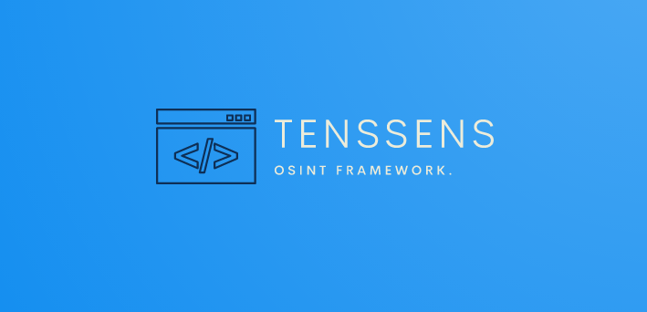

#

# Tenssens - OSINT Framework

### Tenssens framework focused on gathering information from free tools or resources. The intention is to help people find free OSINT resources.

<br>
<br>


### Features 
```yaml
   01. Whois            : Get Website Whois Information.     
   02. MD5 Cracker      : MD5 Hash Cracker.                   
   03. Subdomain finder : Find Subdomain of any website.
   04. Site BuiltWith   : Find CMS of and All Technology.
   05. DNS Lockup       : Get Information About DNS.
   06. Admin Finder     : Find Admin Panel of Website.
   07. HTTP Header      : Get HTTP Header Information.
   08. IP Location      : Find Location From IP Address.
   09. Port Scan        : Network Port Scanner.
   10. Robots.txt       : Get Robots txt File of any website.
```

## Usage.
### <u> linux </u>

```yaml
 apt-get update
 apt-get upgrade
 pkg install git
 pkg install python3
 git clone https://github.com/thenurhabib/tenssens
 cd tenssens
 pip install -r requirements.txt
 python3 tenssens.py

```
### <u> Termux </u>

```yaml
 apt-get update
 apt-get upgrade
 apt install git
 apt install python3
 git clone https://github.com/thenurhabib/tenssens
 cd tenssens
 pip install -r requirements.txt
 python tenssens.py

```

### Login Information 
```yaml
 login Username : username#tenssens
 Login Password : password@tenssens
```


## Screenshot


## 🔗 Links
[](https://www.nurhabib.ml/)
[](https://twitter.com/mdnurhabib)
[](https://hackerrank.com/thenurhabib)

## 🚀 About Me
I'm a programmer and Linux System Administrator.


## Author

```yaml
 Name       : Md. Nur Habib
 GitHub     : https://github.com/thenurhabib
 Facebook   : https://web.facebook.com?thenurhab1b 
 HackerRank : https://www.hackerrank.com/thenurhabib
```
<br>


# <strong> <center> Thank You. </center> <strong>
